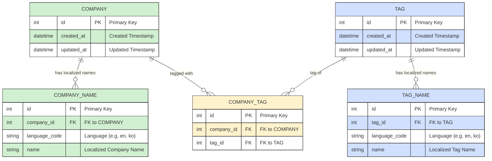

# 회사 정보/태그 다국어 지원 REST API 설계 및 명세

## 0. API 명세서
https://www.notion.so/API-1e1b05b3ee658059aeb4e8051f859d67?pvs=4

## 1. 요구사항 요약

- 회사 정보(회사명, 태그)를 다국어(한국어, 영어, 일본어 등)로 저장 및 검색
- 회사명 자동완성, 회사명/태그명으로 회사 검색 (다국어 지원)
- 태그 추가/삭제 기능
- 동일 회사는 한 번만 노출
- RDB 사용
- ORM 사용
- JSON 응답
- FastAPI/Flask/Django 중 택1 (FastAPI 권장)
- Docker 개발
- 테스트 케이스 통과 필요

---

## 2. 데이터베이스 설계

### 2.1. 테이블 구조

#### 1. Company (회사)
- id (PK)
- created_at
- updated_at

#### 2. CompanyName (회사명, 다국어)
- id (PK)
- company_id (FK)
- language_code (예: 'ko', 'en', 'ja')
- name

#### 3. Tag (태그)
- id (PK)
- created_at
- updated_at

#### 4. TagName (태그명, 다국어)
- id (PK)
- tag_id (FK)
- language_code (예: 'ko', 'en', 'ja')
- name

#### 5. CompanyTag (회사-태그 매핑)
- id (PK)
- company_id (FK)
- tag_id (FK)

---

### 2.2. ERD (Entity Relationship Diagram)

- Company 1:N CompanyName
- Tag 1:N TagName
- Company N:M Tag (CompanyTag로 연결)

---

## 3. API 엔드포인트 명세

### 3.1. 회사명 자동완성
- `GET /search?query={query}`
- `HEADER : x-wanted-language: {ko|en|ja|tw}`
- 입력한 일부 문자열로 회사명 자동완성 (다국어 지원)

### 3.2. 회사명으로 회사 검색
- `GET /companies/{company_name}`
- `HEADER : x-wanted-language: {ko|en|ja|tw}`
- 회사명(다국어)으로 회사 정보 검색

### 3.4. 회사 추가
- `POST /companies`
- `HEADER : x-wanted-language: {ko|en|ja|tw}`
- `BODY : {
  "company_name": {
    {ko|en|ja|tw}: {company_name}
  },
  "tags": [
    {
      "tag_name": {
        {ko|en|ja|tw}: {tag_name_1},
      }
    }
  ]
}`
- 태그명(다국어)으로 회사 정보 검색

### 3.5. 태그명으로 회사 검색
- `GET /tags?query={tag_name}`
- `HEADER : x-wanted-language: {ko|en|ja|tw}`
- 태그명(다국어)으로 회사 정보 검색

### 3.6. 회사 태그 추가
- `PUT /companies/{company_name}/tags`
- `HEADER : x-wanted-language: {ko|en|ja|tw}`
- `BODY : [
  {
      "tag_name": {
        {ko|en|ja|tw}: {tag_name_1},
      }
  }
]`
- 회사에 태그 추가

### 3.7. 회사 태그 삭제
- `DELETE /companies/{company_name}/tags/{tag_name}`
- `HEADER : x-wanted-language: {ko|en|ja|tw}`
- 회사에서 태그 삭제

---

## 4. 예시 데이터

### 회사명
| company_id | language_code | name     |
|------------|--------------|----------|
| 1          | ko           | 오케스트로    |
| 1          | en           | Okestro  |

### 태그명
| tag_id | language_code | name      |
|--------|--------------|-----------|
| 4      | ko           | 태그_4    |
| 4      | en           | tag_4     |
| 4      | ja           | タグ_4    |

---

## 5. 기타

- 모든 검색/자동완성은 다국어로 동작해야 하며, 태그/회사명은 언어별로 매핑되어야 함
- 동일한 회사는 한 번만 결과에 노출
- ORM으로 SQLAlchemy 사용

---

## 6. 확장성 고려

- 언어 추가 시 CompanyName/TagName에 row만 추가하면 됨
- 태그/회사명 동의어 처리도 확장 가능

---
